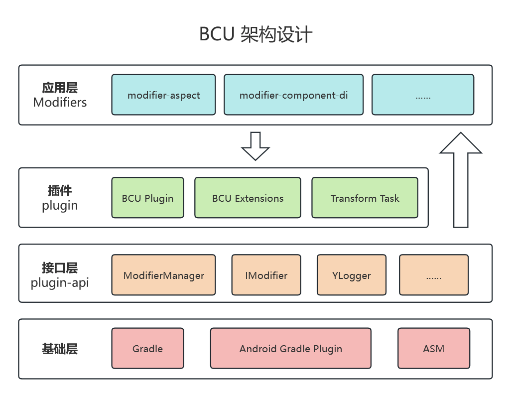
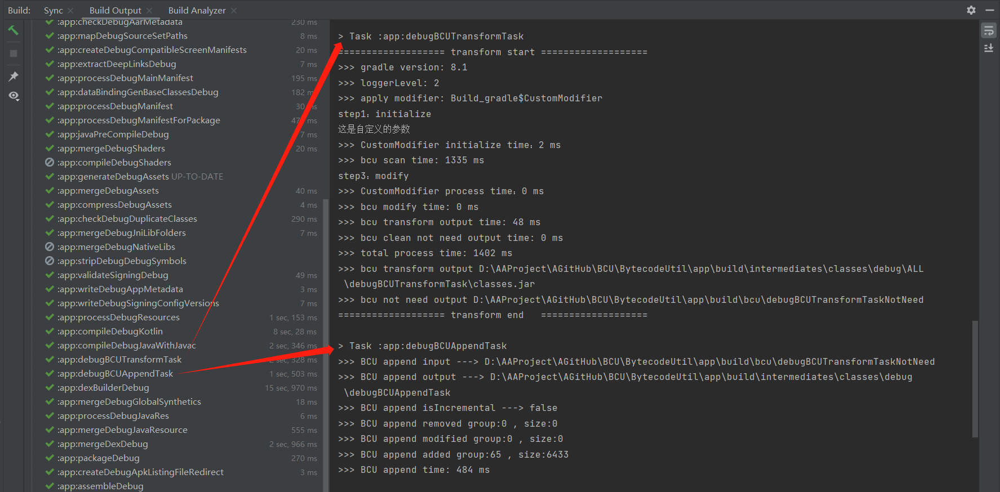

## BCU

本库是一个安卓平台上的基于 [ASM](https://asm.ow2.io/index.html) 实现的轻量级高性能字节码操作平台。目前已经兼容 `AGP 8+`。

此外，本库从设计之初就考虑了 `Transform ` 过程对构建时间的影响，因此特别优化了整体构建流程，能更好的利用缓存，增量，过滤机制，从而大幅减少构建所需的时间。

[](https://jitpack.io/#Ysj001/BytecodeUtil)


### 功能&特性

- [x] v2 版已经支持 `AGP 7.4+`  |  ~~（v1 老版本是基于 `AGP4` 的 `Transform` 接口）~~
- [x] 支持过滤和增量，并优化 `Transform` 流程，合理配置过滤时能极大幅度缩减编译时间。
- [x] 支持根据 `variant` 进行不同的配置和处理。
- [x] 插件内部多线程并行 IO 处理，提升编译速度。
- [x] 基于 `asm-tree`  实现的接口更加易于修改字节码。
- [x] 插件平台化，支持挂载多个字节码修改器，且使用多个修改器也只会有一次 IO 产生。
- [x] 提供了 `plugin-api` 供开发者实现自定义的字节码修改器，甚至不需要再去写 `Gradle` 插件。


### 了解&编译项目



- **BytecodeUtil**
  
  - `app` 用于演示
  - `buildSrc`  管理 maven 发布和版本控制项目统一配置
  - `repos` 的本地 maven 仓库，便于开发时调试
  - `lib_bcu_plugin`  插件工程编译时修改字节码在这里实现
    - `plugin-api`  插件对外提供的 API，基于此可实现自定义的字节码修改器
  
- **注意：在构建前先在项目根目录下执行该命令来生成插件后重新 sync 项目**

  `gradlew publishAllPublicationsToLocalRepository`


### 如何使用

#### Version & AGP & Gradle

[AGP 版本和 Gradle 版本关系点这里](https://developer.android.google.cn/studio/releases/gradle-plugin?hl=zh_cn#updating-gradle)

- v2 版本（**推荐使用**）
  - 基于 `AGP 8.1.1` 的 `variant#artifacts` 接口开发
  - `min AGP 7.4` ~ `max AGP 8+` 
  - 当使用 `AGP 7.4` 时最低应使用 `Gradle 7.5` 不能使用 `Gradle 8`
  - 当使用 `AGP 8+` 时最低应使用 `Gradle 8`
- v1 版本（**已经不维护**）
  - 基于 `AGP 4.1.3`  的 `Transform` 接口开发现在不推荐使用了
  - `min AGP 4.1.3`  ~ `max AGP 7.3`


#### 使用

1. 项目已经发到 `jitpack.io` 仓库，在项目根 `build.gradle.kts` 中配置如下

   ```kotlin
   // Top-level build file
   buildscript {
       repositories {
           maven { setUrl("https://jitpack.io") }
       }
       
       dependencies {
           // BCU 插件依赖
           classpath("com.github.Ysj001.BytecodeUtil:plugin:<lastest-version>")
       }
   }
   
   subprojects {
       repositories {
           maven { setUrl("https://jitpack.io") }
       }
   }
   ```
   
2. 在 `app` 模块的 `build.gradle.kts` 中的配置如下

   ```kotlin
   plugins {
       id("com.android.application")
       id("org.jetbrains.kotlin.android")
       // 添加 bcu 插件
       id("bcu-plugin")
   }
   
   // 插件扩展
   bcu {
       config { variant ->
       	// 设置插件日志级别 （0 ~ 5）
           loggerLevel = 2
       	// 挂载你所需的修改器，可以挂载多个，插件内部按顺序执行
           modifiers = arrayOf(
               // 将 CustomModifier 添加到 bcu 中
               CustomModifier::class.java,
           )
       }
       // 不需要处理的 class 文件过滤器。
       filterNot { variant, entryName ->
           // 这里传 false 表示不过滤
           // 请按需配置过滤，合理配置可提大幅升编译速度
           false
       }
   }
   ```

3. `BCU` 会将需要保留的目标加上 `BCUKeep` 注解，因此只需如下配置即可

   ```tex
   -keepclassmembers class * {
       @com.ysj.lib.bytecodeutil.plugin.api.BCUKeep <methods>;
   }
   ```


#### 开发自定义 Modifier 并使用

**推荐直接查看 `app` 模块，或者查看下文中那些基于 `BCU` 实现的库。**

开发并使用一个自定义的 `Modifier` 非常简单，主要为以下几个步骤：

1. 创建一个用于开发 `Modifier`  的 `java` 模块，并依赖 `plugin-api` 和 `gradleApi`

   ```groovy
   plugins {
       id("java-library")
       id("kotlin")
   }
   dependencies {
       implementation(gradleApi())
       implementation("com.github.Ysj001.BytecodeUtil:plugin-api:<lastest-version>")
   }
   ```

2. 继承 `IModifier` 接口并重写对应方法

   ```kotlin
   class CustomModifier(
       // 注意：executor ， allClassNode 顺序不能变
       override val executor: Executor,
       override val allClassNode: Map<String, ClassNode>,
   ) : IModifier {
   
       private val logger = YLogger.getLogger(javaClass)
       override fun initialize(project: Project) {
           super.initialize(project)
           // 初始化阶段，可以通过 project 拿到所需的配置参数
           logger.lifecycle("step1：initialize")
           // 演示获取自定义参数
           logger.lifecycle(project.properties["modifier.custom"].toString())
       }
   
       override fun scan(classNode: ClassNode) {
           // 扫描阶段，该阶段可以获取到所有过滤后需要处理的 class
           logger.lifecycle("step2：scan -->$classNode")
           // 你可以在这里收集需要处理的 class
           // 注意：该方法非多线程安全，内部处理记得按需加锁
       }
   
       override fun modify() {
           // 处理阶段，该阶段是最后一个阶段，用于修改 scan 阶段收集的 class
           logger.lifecycle("step3：modify")
       }
   }
   ```

3. 在 `app` 模块中使用 `bcu-plugin` 插件并添加这个自定义的 `Modifier` 

   ```kotlin
   plugins {
       id("com.android.application")
       id("org.jetbrains.kotlin.android")
       id("bcu-plugin")
   }
   
   bytecodeUtil {
       loggerLevel = 2
       modifiers = arrayOf(
           // 将 CustomModifier 添加到 bcu 中
           CustomModifier::class.java,
       )
       notNeed = { entryName ->
          	// 自定义过滤规则
           false
       }
   }
   
   // 演示给 CustomModifier 传递自定义参数
   ext["modifier.custom"] = "这是自定义的参数"
   ```


#### 日志解析

了解 `BCU` 的日志系统有助于帮助你开发出更高性能的 `Modifier` ，它能够直观的告诉你各个不同阶段的耗时，好让你便于进行优化。

如下图所示 `BCU` 在运行过程中会执行 2 个任务。

分别为 `<variant>BCUTransformTask` 和 `<variant>BCUAppendTask` 。

`BCUAppendTask` 负责处理增量而 `BCUTransformTask`  负责处理整个修改字节码的过程，因此下面的参数解析主要针对该任务中的 log。



log 对应的具体含义：

| log key                         | 对应含义                                    |
| ------------------------------- | ------------------------------------------- |
| >>> loggerLevel                 | 当前 BCU 的日志等级（0~5）                  |
| >>> variant                     | 当前变体名称                                |
| >>> apply modifier              | 添加进 BCU 的 Modifier                      |
| >>> xxxModifier initialize time | xxxModifier 在 initialize 阶段的耗时        |
| >>> bcu scan time               | BCU 在 scan 阶段的总耗时                    |
| >>> xxxModifier process time    | xxxModifier 在 modify 阶段的耗时            |
| >>> bcu modify time             | BCU 在 modify 阶段的总耗时                  |
| >>> bcu transform output time   | BCU 将 transform 结果输出到 jar file 的耗时 |
| >>> total process time          | BCUTransformTask 处理过程的总耗时           |


### **基于 BCU 实现的库**

- **[modifier-aspect](https://github.com/Ysj001/bcu-modifier-aspect) ：用于实现 AOP 的字节码修改器。**
  - **[PermissionMonitor](https://github.com/Ysj001/PermissionMonitor)：Android 隐私政策敏感权限监控。**

- **[modifier-component-di](https://github.com/Ysj001/bcu-modifier-component-di) ：用于实现组件依赖注入的字节码修改器。**


### **其它**

- **[了解 Gradle 和 Transform 点这（文章基于 AGP4）](https://blog.csdn.net/qq_35365635/article/details/120355777)**
- **如果本项目给予了你帮助那就给个 start 吧。**
- **如果对本项目有疑问欢迎提 issues。**
- **如果想聊聊本库相关问题可加 Q 群 732198194（注明来源）**
