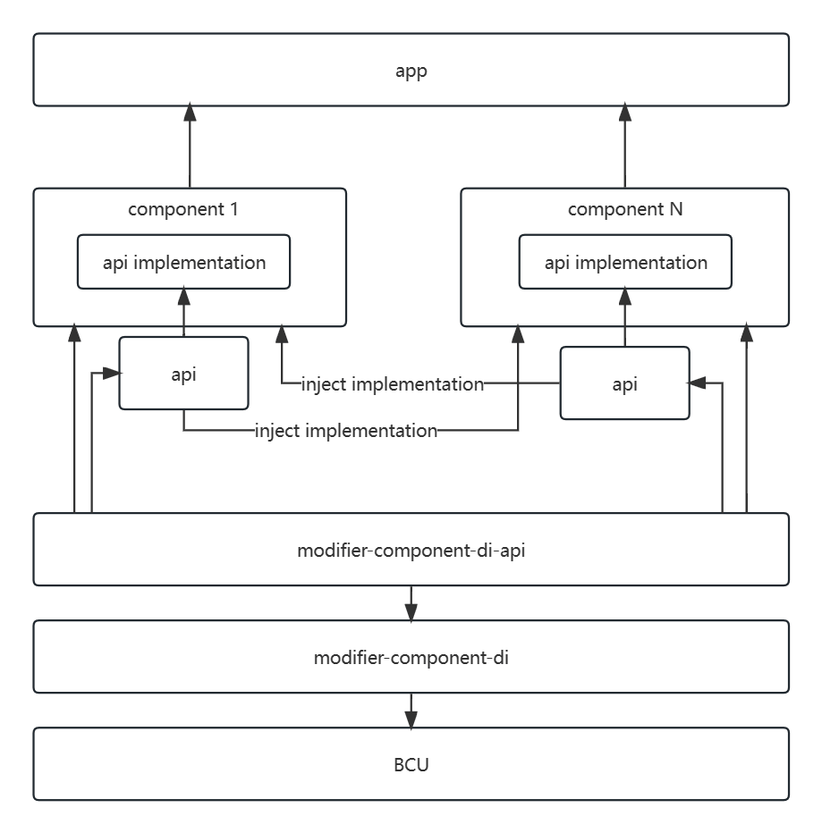

## modifier-component-di

用于实现组件化的，组件接口注入实例的字节码修改器。


### 前言

目前大多数流行的组件化通信方式几乎都采用字符串协议通信，在这种方案下，组件间的通信会变成几乎完全隐式的调用方式。在双方只通过字符协议进行通信时，大量常量字符串将会随着项目的膨胀而越来越难管理和维护。并且复杂的协议解析逻辑也将提升使用成本和调试成本。

如果你不想再维护大量难以理清的字符协议，不想去理解庞大且复杂的组件化库，只想以纯接口的方式实现组件间互相调用或通信，那就使用本库吧！

本库的核心的思想是，组件间调用都只依赖所需组件对外的 api 模块，而组件的具体实现只在 app 模块被依赖，这样分层即可确保组件的实现层不会对其它组件暴露，也能够实现组件间的互相调用。




### 配置

1. 添加 classpath 依赖:

   ```groovy
   // Top-level build file
   buildscript {
       // ...
       dependencies {
           classpath("io.github.ysj001.bcu:modifier-component-di:<lastest-version>")
       }
   }
   ```

2. 添加 modifier：

   ```groovy
   // application build file
   bytecodeUtil {
       modifiers = [
           Class.forName("com.ysj.lib.bcu.modifier.component.di.ComponentDIModifier"),
       ]
   }
   ```

3. 添加依赖：

   ```groovy
   // component build file
   dependencies {
   	implementation("io.github.ysj001.bcu:modifier-component-di-api:<lastest-version>")
   }
   ```


### 使用

建议直接查看 demo 工程，具体如下：

- [使用 @Component 标记组件对外接口](../demo1/demo1-api/src/main/java/com/example/module/demo1/api/Demo1Component.kt)

- [使用 @ComponentImpl 标记组件接口的唯一实现类](../demo1/src/main/java/com/example/module/demo1/Demo1ComponentImpl.kt)

- [使用 @ComponentInject 标记需要注入实例的 field](../app/src/main/java/com/ysj/demo/component/MainActivity.kt)

